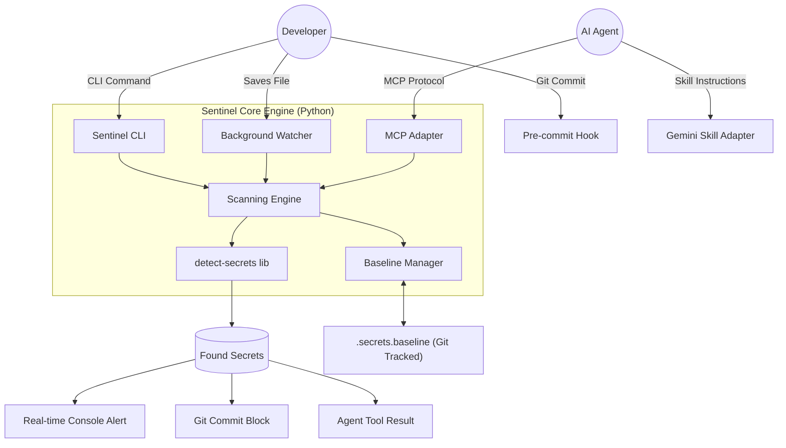

# Architecture Design: Security Sentinel Ecosystem

The Security Sentinel is a multi-layered defense-in-depth system designed to prevent secret leakage at the source. It uses a single core engine with multiple entry points (Adapters).

## 1. System Architecture Overview

## 2. Component Breakdown

### A. The Core Engine (`sentinel/engine.py`)
- **Logic**: Wraps `detect-secrets`. It doesn't just find secrets; it compares them against the "Baseline."
- **State**: The `.secrets.baseline` file is the source of truth. If a secret's hash is in the baseline, it is considered an "approved exception."
- **Categorization**: 
  - **Critical**: Private Keys (`.pem`), AWS Secret Keys.
  - **High**: Generic API Keys, Bearer Tokens.
  - **Medium**: High-entropy strings in config files.

### B. Proactive Watcher (`sentinel/watcher.py`)
- **Operation**: A persistent process triggered via `sentinel watch`.
- **Mechanism**: Uses `watchdog` to hook into OS-level file system events. 
- **Efficiency**: Only scans the specific file that was modified, keeping overhead near zero.
- **UX**: Prints a high-visibility warning to the terminal immediately upon save.

### C. The MCP Adapter (`sentinel/mcp_server.py`)
- **Purpose**: Interoperability with Claude Code and other MCP-native agents.
- **Protocol**: Implements the Model Context Protocol over `stdio`.
- **Tools Exposed**:
  - `sentinel_scan(path)`: Scans a file or directory.
  - `sentinel_status()`: Summarizes current baseline vs. new findings.
  - `sentinel_approve(finding_id)`: Appends a finding to the baseline.

### D. The Git Enforcement (`.pre-commit-config.yaml`)
- **Purpose**: The "Hard Gate."
- **Operation**: Runs `sentinel scan --staged` before every commit.
- **Outcome**: Returns exit code 1 if new secrets are found, aborting the `git commit` command.

## 3. Data Flow: The "Approval" Lifecycle

1. **Detection**: Developer adds `API_KEY = "12345"` to `config.py`.
2. **Alert**: The Watcher prints: `[SECURITY ALERT] New High-entropy string in config.py`.
3. **Review**: Developer asks an AI Agent: *"Is this a secret?"*
4. **Resolution (Two Paths)**:
   - **Fix**: Developer moves the key to an `.env` file (which is ignored).
   - **Approve**: If it's a false positive, the Developer/Agent runs `sentinel approve <ID>`. 
5. **Persistence**: The Sentinel Engine adds the hash of the false positive to `.secrets.baseline`.
6. **Commit**: `git commit` now succeeds because the secret is "known and approved."

## 4. Addressing "Post-Commit" & External MCP Servers

**Do we need a GitHub MCP server?**
- **Short Answer**: No, not for *prevention*. 
- **Long Answer**: A GitHub MCP server or GitHub Action is a "Secondary Audit" layer. It scans code *after* it's already left your machine. 
- **Our Strategy**: We focus on the **Shift-Left** approach. By the time code reaches GitHub, our Sentinel has already verified it. Our local Sentinel **is** the MCP server that the agent uses to prevent the leak before the commit even happens.

## 5. Security Model
- **No Plaintext**: The `.secrets.baseline` file stores only hashes and metadata, never the actual secrets.
- **Git Tracked**: The baseline file is committed to the repo, ensuring the whole team shares the same "Approved Exceptions" list.
- **Local Only**: No data ever leaves the machine during a scan. It is 100% private and air-gapped.
