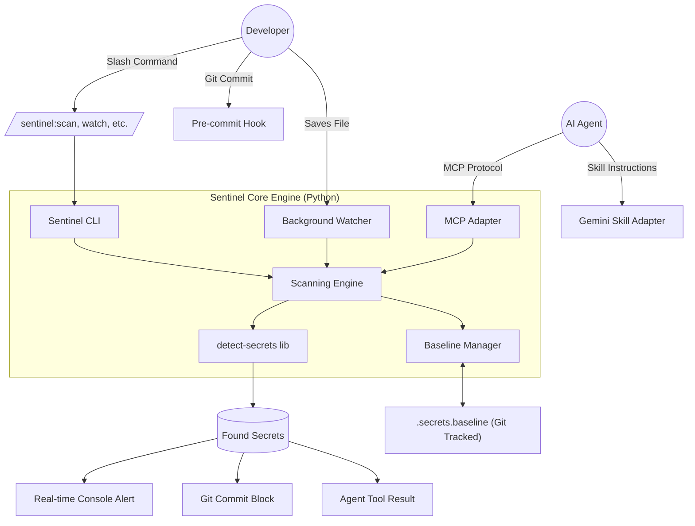

# Architecture Design: Security Sentinel Ecosystem

The Security Sentinel is a multi-layered defense-in-depth system packaged as a **Gemini CLI Extension**. It bundles a core engine with multiple adapters for native agent integration.

## 1. System Architecture Overview

## 2. Component Breakdown

### A. The Gemini Extension Manifest (`gemini-extension.json`)
- **Role**: The entry point for the CLI. It registers the extension name, bundles the skill, and automatically configures the MCP server.

### B. Native Slash Commands (`commands/sentinel/*.toml`)
- **Role**: Provides the native UI dropdown in the Gemini CLI.
- **Commands**:
  - `/sentinel:scan`: Trigger an audit.
  - `/sentinel:watch`: Start background monitoring.
  - `/sentinel:stop`: Kill background monitoring.
  - `/sentinel:init`: Setup the baseline.

### C. The Core Engine (`sentinel/`)
- **Logic**: Unified Python code providing scanning, watcher, and MCP logic.
- **State**: Managed via the `.secrets.baseline` file.

### D. Bundled Agent Skill (`skills/security-sentinel/`)
- **Role**: Provides the AI agent with the procedural knowledge to use the engine effectively.

### E. Git Enforcement (`.pre-commit-config.yaml`)
- **Role**: The final local gate before code leaves the machine.

## 3. Data Flow: The "Approval" Lifecycle

1. **Detection**: Developer adds `API_KEY = "12345"` to `config.py`.
2. **Alert**: The Watcher prints: `[SECURITY ALERT] New High-entropy string in config.py`.
3. **Review**: Developer asks an AI Agent: *"Is this a secret?"*
4. **Resolution (Two Paths)**:
   - **Fix**: Developer moves the key to an `.env` file (which is ignored).
   - **Approve**: If it's a false positive, the Developer/Agent runs `sentinel approve <ID>`. 
5. **Persistence**: The Sentinel Engine adds the hash of the false positive to `.secrets.baseline`.
6. **Commit**: `git commit` now succeeds because the secret is "known and approved."

## 4. Addressing "Post-Commit" & External MCP Servers

**Do we need a GitHub MCP server?**
- **Short Answer**: No, not for *prevention*. 
- **Long Answer**: A GitHub MCP server or GitHub Action is a "Secondary Audit" layer. It scans code *after* it's already left your machine. 
- **Our Strategy**: We focus on the **Shift-Left** approach. By the time code reaches GitHub, our Sentinel has already verified it. Our local Sentinel **is** the MCP server that the agent uses to prevent the leak before the commit even happens.

## 5. Security Model
- **No Plaintext**: The `.secrets.baseline` file stores only hashes and metadata, never the actual secrets.
- **Git Tracked**: The baseline file is committed to the repo, ensuring the whole team shares the same "Approved Exceptions" list.
- **Local Only**: No data ever leaves the machine during a scan. It is 100% private and air-gapped.
